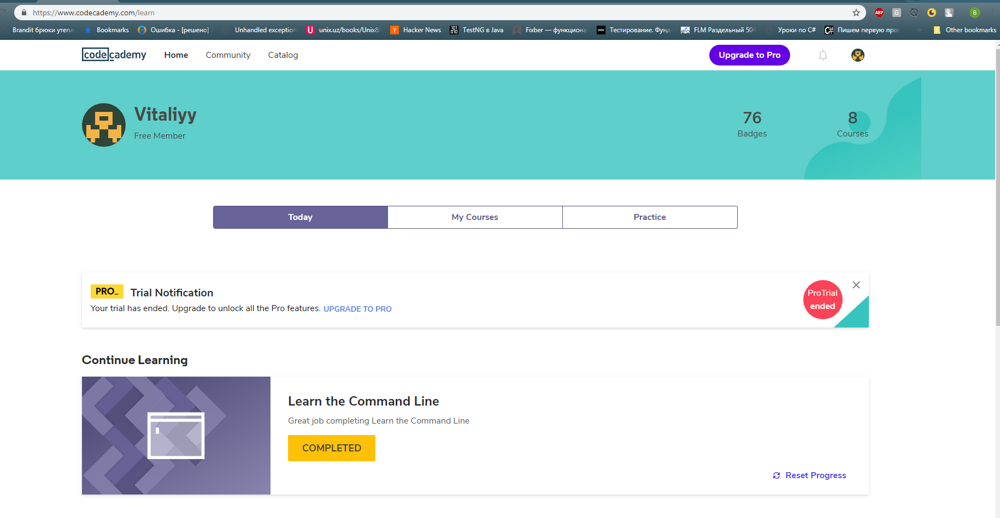

I received structured information about GIT from this two educational portal.

## Hi team
[I'm](https://github.com/V1taliy) Vitaliy from Kiev and I want to join Kottans Team!
##

## Linux CLI, and HTTP

* what was new to you: 
info about desktop tools to View HTTP Traffic was new to me
* what surprised you:
NodeJS with it ExpressJS library, where already created list of usfull methods for working with HTTP

* what you intend to use in future:
I will try to download Fiddler to View HTTP Traffic, its looks like powerfull tool.

## Git Collaboration
[Git Collaboration](task_git_collaboration/githubColaboration.png)
[Git How To](task_git_collaboration/howToGit.png)

+ Working with diferent branches was new for me, its very helpfull information
+ Info about pull requests and working in team intresting and helpfull for people which works on same project

## Intro to HTML and CSS
[Udacity](task_html_css_intro/Udacity_HTML&CSS.png)
[HTML academy 1](task_html_css_intro/HTML_academy1.png)
[HTML academy 2](task_html_css_intro/HTML_academy2.png)

+ In this section I'm not find anything new for me, previously I already finish this sections. I repeat some theme, repeat CSS.

## Responsive Web Design
[flex-box-froggy](task_responsive_web_design/flex-box-froggy.png)
[Udacity_responsive](task_responsive_web_design/Udacity_responsive.png)

+ Flexbox froggy I've finished before, at this time I repeat it again.
+ Udacity responsive course was interesting for me. Debugging on mobile devices was new for me and very usefull.
+ Info about media query wasn't new for me, but interesting.
